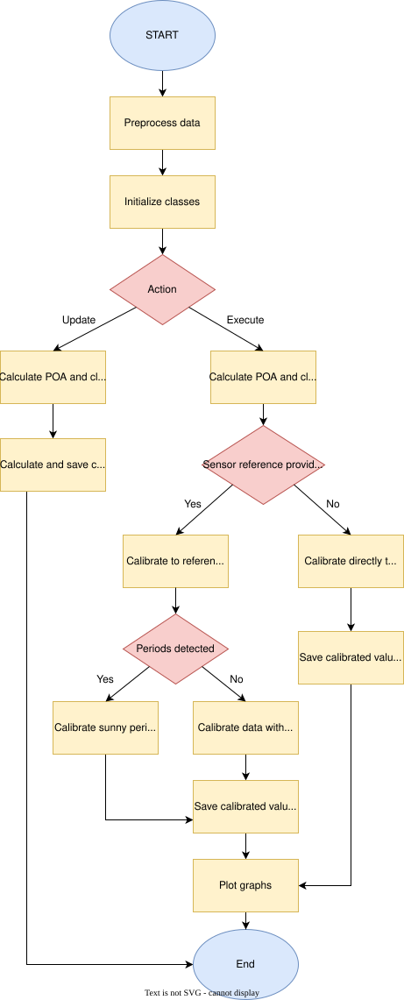

[](https://Girgitt.github.io/solar_fit_test/)


## Table of contents

* [About](#-about)
* [How to build](#-how-to-build)
* [Usage](#-usage)
* [Configuration options](#-configuration-options)
* [Documentation](#-documentation)
* [Examples](#-examples)
* [License](#-license)
* [Contacts](#-contacts)

## 🚀 About
The solar fitting library provides end-to-end support for solar irradiance data calibration, analysis, and reporting.
It is built around flexibility, reusability, and reliability so that pipelines can be adapted to different sensor
setups and research workflows. Core benefits include:

* __Modularity__: Independent components for data loading, preprocessing, model fitting, plotting, and export.
* __Testability__: Focused functions and classes simplify validation of each pipeline stage.
* __Maintainability__: A clear separation of responsibilities keeps the codebase approachable for contributors.

Typical use cases include:

* Calibrating low-cost irradiance sensors against a reference sensor
* Performing clear-sky detection and filtering to improve signal quality
* Fitting regression models (e.g., linear, polynomial, Gaussian processes, splines)
* Generating plots, logs, and diagnostics for solar data analysis
* Exporting calibration coefficients for microcontrollers or downstream systems

The source code is organized as a Python package under `solar_fit_test/src`, with dedicated modules for data
ingestion, calibration logic, model management, plotting utilities, and supporting helpers.

## 📝 How to build
```
# Open a terminal (Command Prompt or PowerShell for Windows, Terminal for macOS or Linux)

# Ensure Git is installed
# Visit https://git-scm.com to download and install console Git if not already installed

# Clone the repository
git clone https://github.com/Girgitt/solar_fit_test.git

# Navigate to the project directory
cd solar_fit_test

# Create virtual environment

#Linux/macOS:
   python -m venv .venv
   source .venv/bin/activate
   
#Windows:
   python -m venv .venv
   .venv\Scripts\activate
   
# Install dependencies
pip install -e .

# Verify installation
python -c "import solar_fit_test; print('OK')"
```

--------------------------------------------------------------------

To generate SPHINX documentation of the project open command line and move to ``solar_fit_test/docs``
then execute following commands:
* ``make clean``
* ``make html``

Then navigate to ``solar_fit_test/docs/build/html/index.html`` and open the documentation.

--------------------------------------------------------------------

To generate dependency graph (by using pydeps library) open command line and move to the project folder
``solar_fit_test`` then execute the command:

general:

``pydeps <filename> -o <output_name> -T <output_type>``

example:

``pydeps src/pvtools --only main pvtools --max-module-depth 2 --max-bacon 2 --cluster --rmprefix pvtools. --rankdir LR -o graph.svg``

Check ``--help`` for other options.


## ⚙️ Configuration options

There are several input parameters to properly set all calibration pipeline. Below is list of configuration parameters:
* ``--action``: Specify whether to 'update' (train/save) or 'execute' (load/apply) the model.
* ``--model_id``: Model identifier used for saving/loading coefficients.
* ``--csv``: Path to CSV file with input data.
* ``--calibration``: Defines which calibration method use to calibrate sensors.
* ``--sensors``: List of sensors to calibrate. Number of specified column, counting from 0, skipping time column. 
Accept multiple numbers separated by space.
* ``--reference``: Number of specified column, counting from 0, skipping time column. Accept single number.
* ``--project_dir``: Force specific data directory to store logs, plots etc. Default: current working directory.
* ``--calibration_metrics_dir``: Directory which contains all metrics needed for calibration.
* ``--start_time_hour``: Start time (hour) for filter only day time period (GMT).
* ``--start_time_minute``: Start time (minute) for filter only day time period.
* ``--end_time_hour``: Start time (hour) for filter only day time period (GMT).
* ``--end_time_minute``: Start time (minute) for filter only day time period.
* ``--latitude``: Decimal latitude coordinates of measurement station (default Warsaw).
* ``--longtitude``: Decimal longtitude coordinates of measurement station (default Warsaw).
* ``--timezone``: Time zone of measurement station (default Europe/Warsaw). Check 'pytz.all_timezones' for all
available options.
* ``--altitude``: Altitude of measurement station in meters.
* ``--name``: Name for measurement station.
* ``--frequency``: Target timestamps for filterenig dataset. Available formats: 'xs' 'xmin' 'xh' 'xms'
where x is a number.
* ``--albedo``: Ratio of reflected solar irradiance to global horizontal irradiance (unitless).
* ``--surface_tilt``: Surface tilt of the sensor in degrees (default 0, horizontal).
* ``--surface_azimuth``: Surface azimuth of the sensor in degrees (default 180, south).
* ``--divided_linear_regression_intervals``: Time interval for one block in divided linear regression.
For all possibilities refer to: https://pandas.pydata.org/docs/user_guide/timeseries.html#timeseries-offset-aliases.

## 📚 Documentation




📘 Full documentation is available at  
[HTML Documentation](https://Girgitt.github.io/solar_fit_test/)


## 🖥️ Usage

The calibration pipeline is orchestrated by ``src/main.py`` (also exposed as the ``pvtools`` CLI in editable
installs). The workflow relies on two complementary actions:

* ``update``: preprocess input CSV data, detect clear-sky periods, fit calibration metrics for configured models, and
  store artifacts (plots, logs, calibrated datasets) in the chosen project directory.
* ``execute``: load previously generated metrics and apply them to new datasets to produce calibrated outputs and
  diagnostics.

Basic usage pattern:

```bash
# Train and save calibration metrics
python src/main.py \
  --action update \
  --model_id example_calibration \
  --csv data/org/sample.csv \
  --calibration linear \
  --sensors 0 1 2 \
  --reference 3 \
  --start_time_hour 4 --start_time_minute 0 \
  --end_time_hour 18 --end_time_minute 0 \
  --latitude 52.22977 --longtitude 21.01178 --timezone Europe/Warsaw \
  --altitude 170 --name Warsaw --frequency 1min \
  --albedo 0.25 --surface_tilt 0 --surface_azimuth 180 \
  --project_dir ./calibration_run

# Apply saved metrics to new data
python src/main.py \
  --action execute \
  --model_id example_calibration \
  --csv data/org/new_measurements.csv \
  --calibration linear \
  --sensors 0 1 2 \
  --start_time_hour 4 --start_time_minute 0 \
  --end_time_hour 18 --end_time_minute 0 \
  --latitude 52.22977 --longtitude 21.01178 --timezone Europe/Warsaw \
  --altitude 170 --name Warsaw --frequency 1min \
  --albedo 0.25 --surface_tilt 0 --surface_azimuth 180 \
  --project_dir ./calibration_run \
  --calibration_metrics_dir ./calibration_run/logs/sample
```

Use ``python src/main.py --help`` (or ``pvtools --help`` if the CLI is installed) for a full reference of available
arguments.

## 🌇 Examples

Sample datasets are available under ``data`` and can be used to trial the pipeline. Logs, plots, and processed files
are stored under the project directory supplied via ``--project_dir``. The ``diagrams`` folder contains high-level
architecture visuals, and further examples are covered in the HTML documentation.

## 📃 License
All rights reserved.
You may not use, copy, modify, or distribute this project without explicit permission.

## 🗨️ Contacts
For questions or collaboration inquiries, feel free to reach out:

**Mateusz Kania**

📧Email: mateusz.kania@ttas.pl

🐙GitHub: https://github.com/kaniamateusz